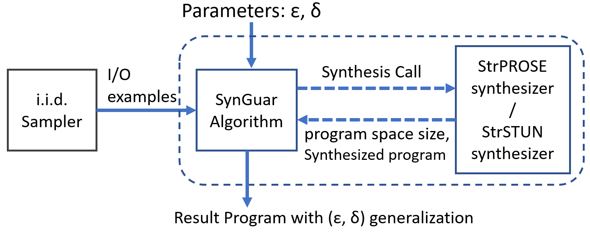
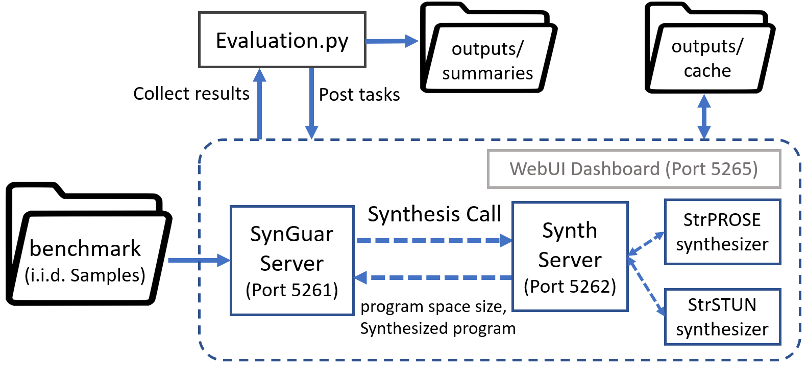

--------

> This is the artifact for the [paper](./AcceptedPaper.pdf) *SynGuar: Guaranteeing Generalization in Programming by Example* accepted by ESEC/FSE 2021.


This repo is a program synthesis framework that provides PAC-style generalization guarantee while doing PBE program synthesis on i.i.d. samples. The top-level is the `SynGuar` algorithm that decides sufficient sample size for $(\epsilon, \delta)$-generalization based on the size of hypothesis space calculated by the program synthesizer after seeing some I/O examples. 

Here $(\epsilon, \delta)$-generalization means with probability at least $1-\delta$, the synthesized programv $f$ has true error $\mathop{\mathbb{E}}[\mathbb{I}[f(x) \neq c(x)]]$ smaller than $\epsilon$ with respect to the target function $c$ on the distribution $D$ where the I/O examples are sampled from. See [SynGuar-algorithm](./docs/proofs/proofs.pdf) for details about this algorithm. 



A crucial requirement for `SynGuar` to work is that the synthesizer needs to soundly calculate an upper bound of the size of hypothesis space given some I/O examples. We provide two PBE synthesizers `StrSTUN` and `StrPROSE` in this repo that have such ability. They can be combined with `SynGuar` algorithm to synthesize programs with generalization guarantee. 
## Structure

This repo contains the implementation of SynGuar algorithm with two PBE synthesizers:
- `SynGuar` local servers
  - Python3 implementation of `SynGuar` algorithm
  - In the form of a set of REST API servers
  - Decides sample size for provable generalization guarantee. Combined with `StrSTUN` and `StrPROSE` to use.
  - In folder `./SynGuar`
  - See [Details-SynGuar.md](./docs/Details-SynGuar.md) for details
- `StrPROSE` synthesizer
  - C# implementation of a PROSE-based synthesizer
  - Designed for string transformation PBE tasks
  - Version-Space Algebra
  - In folder `./StrPROSE-synthesizer`
  - See [Details-StrPROSE.md](./docs/Details-StrPROSE.md) for details
- `StrSTUN` synthesizer
  - C++ implementation of a STUN-like synthesizer
  - Designed to solve SyGuS string PBE tasks
  - Explicit search with observational equivalence reduction and top level `if-then-else` unification
  - In folder `./StrSTUN-synthesizer`
  - See [Details-StrSTUN.md](./docs/Details-StrSTUN.md) for details

This repository also contains benchmarks for the evaluation (See [Benchmark.md](./docs/Benchmark.md)):
- benchmark for `StrPROSE` and `SynGuar-PROSE` (`SynGuar-PROSE` is `SynGuar` algorithm with `StrPROSE`)
  - Benchmark written by ourselves
  - In folder `./benchmark/strprose`
- benchmark for `StrSTUN` and `SynGuar-STUN` (`SynGuar-STUN` is `SynGuar` algorithm with `StrSTUN`)
  - Benchmark from `SyGuS-2019`, `PBE_String` track.
  - In folder `./benchmark/strstun`

The following figure shows the workflow of this implementation of `SynGuar`. The `SynGuar` algorithm is implemented as the `SynGuar` Server, and the two PBE synthesizers `StrPROSE` and `StrSTUN` are proxied by `Synth` Server which communicates with `SynGuar` Server. The `benchmark` folder contains i.i.d.samplers that can generate i.i.d. samples for `SynGuar`. 

To use `SynGuar`, first step is to write i.i.d. examples to file. Then post a program synthesis task as an HTTP request to  `SynGuar` Server. Then pull results from it when the task is done.




## Build & Run

There are 2 ways to build and run those tools.

### Set up tools using Docker
requirements: linux system with Docker and bash shell.  
Details: See [BuildRun-Docker.md](./docs/BuildRun-Docker.md) for details.  

Steps to run the docker container:
  1. Make sure `docker` is running and can be controlled under the current user.
  2. Run `./docker-build.sh` to build the docker image, or run `docker pull unionss/synguar:v0.1.0` and `docker tag unionss/synguar:v0.1.0 synguar:v1` to pull and rename the docker image in case the build is not successful.
  3. Run `./docker-run.sh` to start a container that is running in the background from the built image.
  4. Run `./docker-connect.sh` to connect to the running container, with a bash shell.
  5. Run `./docker-stop.sh` to stop the running container.

### Set up tools directly (On Ubuntu 18.04/20.04)
See [BuildRun-Ubuntu.md](./docs/BuildRun-Ubuntu.md) for details.

### Run SynGuar servers
Start 3 terminals under the folder `./SynGuar`. Then run each of those 3 commands on a terminal:
```
python3 server-synth.py --config ./server-config-512g-16thread.json
python3 server-synguar.py --config ./server-config-512g-16thread.json
python3 webui.py
```
The first two run servers with specified memory and thread configuration (See [Details-SynGuar.md](./docs/Details-SynGuar.md) for configuration), and the third one provides a monitoring interface in the browser. After the servers start, can interact with them through HTTP requests. For example, the `evaluation.py` script will post tasks and collect data through http requests. See [Details-SynGuar.md](./docs/Details-SynGuar.md) for details.


## Run the evaluation

### Generate auxiliary benchmark files
Run the following commands to generate examples for benchmarks.
```
cd benchmark
python3 ./generate_examples_strprose.py
python3 ./generate_examples_strstun.py
```

The random seeds are read from the following files:
- `StrPROSE` benchmark: `benchmark/strprose/example_files/_seeds.json`
- `StrSTUN` benchmark: `benchmark/strprose/example_files/_seeds.json`.

See details at [Benchmark.md](./docs/Benchmark.md).

### Run the evaluation tasks

First Step: Make `SynGuar/server-synth.py` and `SynGuar/server-synguar.py` up and running. (`SynGuar/webui.py` is optional, only for monitoring server status). See the previous section **Run SynGuar servers** for detail.

Second Step: Run `cd SynGuar` to enter `SynGuar` directory. Run the following commands to submit evaluation tasks one at a time. After running each command, wait until the tasks are processed (Use optional Web UI for monitoring).

```
cd SynGuar
python3 evaluation.py run-prose   # wait until finish
python3 evaluation.py sdrop-prose # wait until finish
python3 evaluation.py run-stun    # wait until finish
python3 evaluation.py 4eg-stun    # wait until finish
```

After running the `evaluation.py` script, go to `http://localhost:5265/ui/synth/dashboard.html` to check the progress of synthesis tasks, and `http://localhost:5265/ui/synguar/dashboard.html` for the progress of `SynGuar` algorithm on the benchmarks.

Notice that some benchmarks in `run-stun` evaluation tasks require 512GB memory to terminate. For other evaluation tasks, 8GB memory in total suffices. See [Evaluation.md](./docs/Evaluation.md) for details.

### Collect and analysis data

After finishing the benchmark tasks, please use the following command to collect data. Notice that data collection requires the `server-synth.py` and `server-synguar.py` to be up and running for data queries. Run the following command one after another:

```
cd SynGuar
python3 evaluation.py data-prose  # wait until finish
python3 evaluation.py data-stun   # wait until finish
```

After the data collection is finished, 
for `strprose` benhmark, all data required 
in the paper is written to `./outputs/summaries` folder. For `strstun` benchmark, manual comparison of result programs is required.
See [Evaluation.md](./docs/Evaluation.md) for details.

## Other Information

### Run StrPROSE synthesizer manually
See [Details-StrPROSE.md](./docs/Details-StrPROSE.md) for details.

After the tool is built, go to the root library of this repo (or default directory of docker container), and run the following to see usage.
```
 dotnet ./StrPROSE-synthesizer/StrPROSE/bin/Debug/netcoreapp3.1/StrPROSE.dll --help
```

### Run StrSTUN synthesizer manually

See [Details-StrSTUN.md](./docs/Details-StrSTUN.md) for details.

After the tool is built, go to the root library of this repo (or default directory of docker container), then run the following to run `StrSTUN` synthesizer interactively.
```
./build-strstun/strstun
```

### How to extend

To extend the `SynGuar` framework, you need to have a synthesizer with the ability to count the program space size consistent with a given set of I/O examples specified by a file. You need to write i.i.d. samples to files that can be understood by your synthesizer. Then you need to add proxy code for your synthesizer in `./SynGuar/server_synth/worker.py` follow the examples of `StrPROSE` and `StrSTUN`, and add log parsing code for your synthesizer's
output in `./SynGuar/server_synth/cachereader.py`.